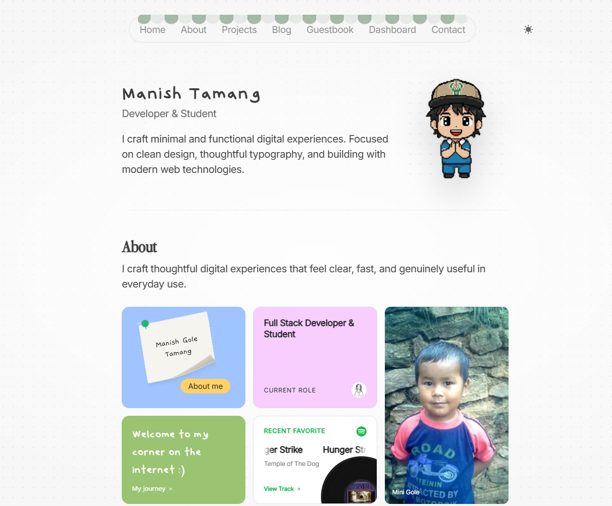

# Manish Tamang - Personal Portfolio

Welcome to my personal portfolio website, a showcase of my professional journey, technical skills, and creative endeavors. Built with cutting-edge web technologies, this site offers an immersive experience into my world of development and design.

[](https://nextjs.org/) [](https://react.dev/) [](https://www.typescriptlang.org/) [](https://tailwindcss.com/) [](https://www.sanity.io/) [](https://supabase.com/) [](https://www.postgresql.org/) [](https://www.better-auth.com/) [](https://resend.com/) [](https://vercel.com/) [](./LICENSE)

Live site: [manishtamang.com](https://manishtamang.com)



## Overview

A minimal, content-driven portfolio built on the Next.js App Router. Writing and project data are managed in Sanity, the guestbook runs on Supabase with social sign-in, and the dashboard pulls live stats from WakaTime, GitHub, Umami, Spotify, and daily.dev.

## Tech Stack

| Area | Tools |
| --- | --- |
| Framework | Next.js 16, React 19, TypeScript |
| Styling | Tailwind CSS v4, Radix UI |
| Content | Sanity |
| Data | Supabase, PostgreSQL |
| Auth | Better Auth (GitHub, Google) |
| Email | Resend |
| Analytics | Umami, Vercel Analytics, Speed Insights |
| Hosting | Vercel |

## Pages

| Route | Description |
| --- | --- |
| `/` | Homepage with featured projects and posts |
| `/about` | Bio, education, and timeline |
| `/bio` | Extended personal journal |
| `/projects` | Selected client and personal work |
| `/blog` | Articles and notes |
| `/guestbook` | Visitor messages with replies and reactions |
| `/dashboard` | Coding stats, traffic, and reading list |
| `/uses` | Gear and software |
| `/photos` | Photo collection |
| `/colophon` | Site credits and stack details |
| `/contact` | Contact form |

## Project Structure

```
app/          Routes, layouts, and API handlers
components/   UI grouped by feature
data/         Static content
hooks/        Shared React hooks
lib/          API clients, auth, and utilities
sanity/       Schemas, queries, and Studio config
public/       Images and static assets
styles/       Global CSS
```

## Getting Started

Requires Node.js 20 or later and pnpm.

```bash
pnpm install
pnpm dev
```

The site runs at `http://localhost:3000`, and the Sanity Studio at `/studio`.

## Scripts

| Command | Description |
| --- | --- |
| `pnpm dev` | Start the development server |
| `pnpm build` | Create a production build |
| `pnpm start` | Serve the production build |
| `pnpm lint` | Run ESLint |

## Environment Variables

Create a `.env.local` file in the project root. Values prefixed with `NEXT_PUBLIC_` are exposed to the browser; everything else must stay server-side.

```bash
# Site
NEXT_PUBLIC_SITE_URL=

# Sanity
NEXT_PUBLIC_SANITY_PROJECT_ID=
NEXT_PUBLIC_SANITY_DATASET=
NEXT_PUBLIC_SANITY_API_VERSION=
SANITY_API_WRITE_TOKEN=

# Auth
DATABASE_URL=
BETTER_AUTH_SECRET=
BETTER_AUTH_URL=
NEXT_PUBLIC_BETTER_AUTH_URL=
GITHUB_CLIENT_ID=
GITHUB_CLIENT_SECRET=
GOOGLE_CLIENT_ID=
GOOGLE_CLIENT_SECRET=
ADMIN_EMAIL=
NEXT_PUBLIC_ADMIN_EMAIL=

# Guestbook
NEXT_PUBLIC_SUPABASE_URL=
NEXT_PUBLIC_SUPABASE_ANON_KEY=
SUPABASE_SERVICE_ROLE_KEY=
RESEND_API_KEY=

# Dashboard
WAKATIME_CLIENT_ID=
WAKATIME_CLIENT_SECRET=
WAKATIME_REDIRECT_URI=
WAKATIME_ACCESS_TOKEN=
DAILY_API_KEY=
UMAMI_API_URL=
UMAMI_API_KEY=
WEBSITE_ID=
SPOTIFY_CLIENT_ID=
SPOTIFY_CLIENT_SECRET=
SPOTIFY_REFRESH_TOKEN=

# Contact
NEXT_PUBLIC_TIMEZONEDB_API_KEY=
NEXT_PUBLIC_WEB3FORMS_ACCESS_KEY=
NEXT_PUBLIC_CALENDLY_URL=
NEXT_PUBLIC_FEEDBACK_FISH_ID=
```

## Deployment

The site is deployed on Vercel. 

## License

This project is available for **reference and educational purposes only**.

You are welcome to inspect the source code and learn from it, but you may not
copy, redistribute, modify, or use substantial portions of this project to
create or launch another website without permission.

See [LICENSE](./LICENSE) for the full terms.
